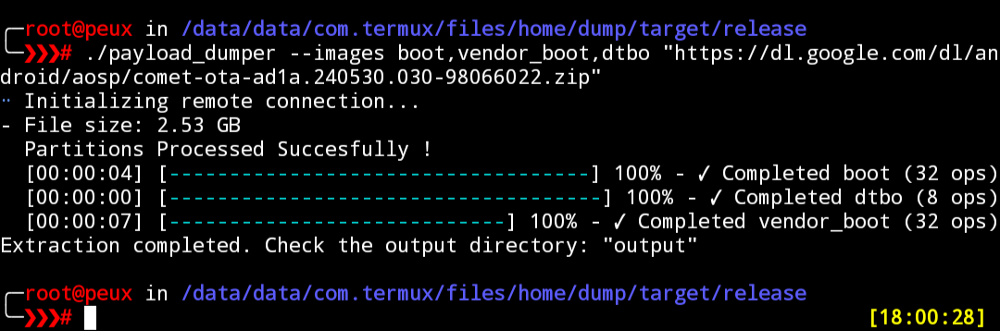

# payload-dumper-rust
Android OTA payload dumper written in Rust utilising c libraries


## features
- Extracts all or individual images directly from payload.bin or ROM ZIP files with minimal time difference.

- Supports extracting individual partitions from URLs without downloading the full ROM ZIP.

- All decompression processes run in parallel for improved performance. ( can be customised by using`--no-parallel` or `--threads <n>` as argument )


Here are some performance metrics from a **Poco X4 Pro (SD695, 8GB RAM)** running in Termux:

- **Direct Payload Extraction**: Extracting partitions directly from the `payload.bin` took **2 minutes 26 seconds**.

- **ZIP File Extraction**: Extracting partitions directly from the ZIP file took **2 minutes 30 seconds**, just **4 seconds difference**

- It can also extract partition directly from **URL** without having you to download the full rom zip file

### Screenshots

- **Direct Payload Extraction**:  
  

- **ZIP File Extraction**:  
  

- **Remote URL Extraction**:  
  


### Usage :
#### Basic Usage

To extract partitions from a payload file, run the following command:

```bash
payload-dumper <path/to/payload.bin> --out output_directory
```
#### Direct ZIP Processing

it can directly process payloads from ZIP files without requiring manual extraction. Simply provide the path to the ZIP file:

```bash
./payload-dumper <path/to/ota.zip> --out <output_directory>
```

#### Remote Payloads

it can also handle payloads/zips directly using url.  Simply provide the URL as path. this is very slow compared to local 
extraction though.

```bash
./payload-dumper https://example.com/payload.bin
```
#### Individual partitions extraction.

to extract individual partitions from payloads/URL/zips , hse `--images`. enter the name of partitions you want to extract comma-separated.

for example to just extract boot and vendor_boot from url/zip/payload , simply run

```
payload_dumper --images boot,vendor_boot <https://example.com/zip>
```
```
Usage: payload_dumper [OPTIONS] <PAYLOAD_PATH>

Arguments:
  <PAYLOAD_PATH>  
      Path to the payload file.

Options:
  --out <OUT>  
      Output directory for extracted partitions. [default: output]

  --diff  
      Enable differential OTA mode (requires --old).

  --old <OLD>  
      Path to the directory containing old partition images (required for --diff). [default: old]

  --images <IMAGES>  
      Comma-separated list of partition names to extract (default: all partitions)

  --threads <THREADS>  
      Number of threads to use for parallel processing.

  --list  
      List available partitions in the payload.

  --metadata  
      Save payload metadata as JSON.
```


### Acknowledgements
- [vm03/payload_dumper](https://github.com/vm03/payload_dumper)
