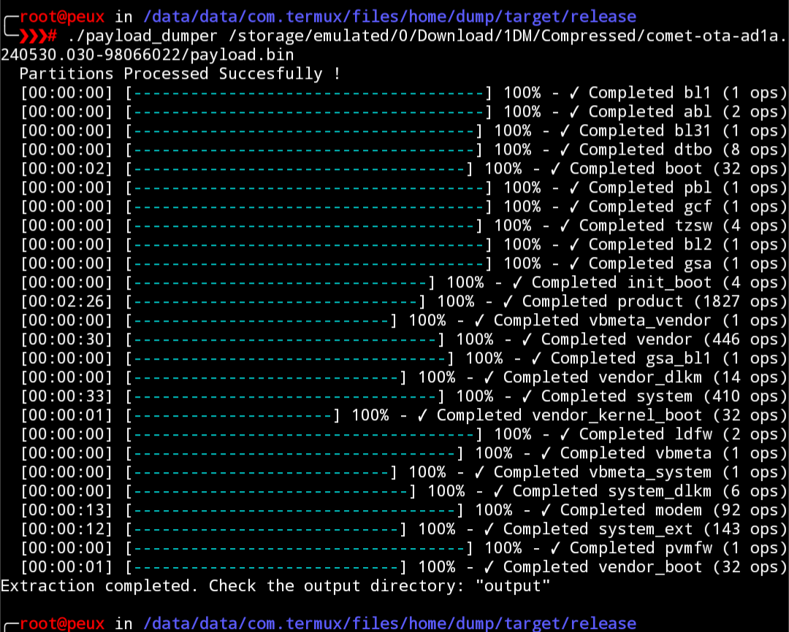
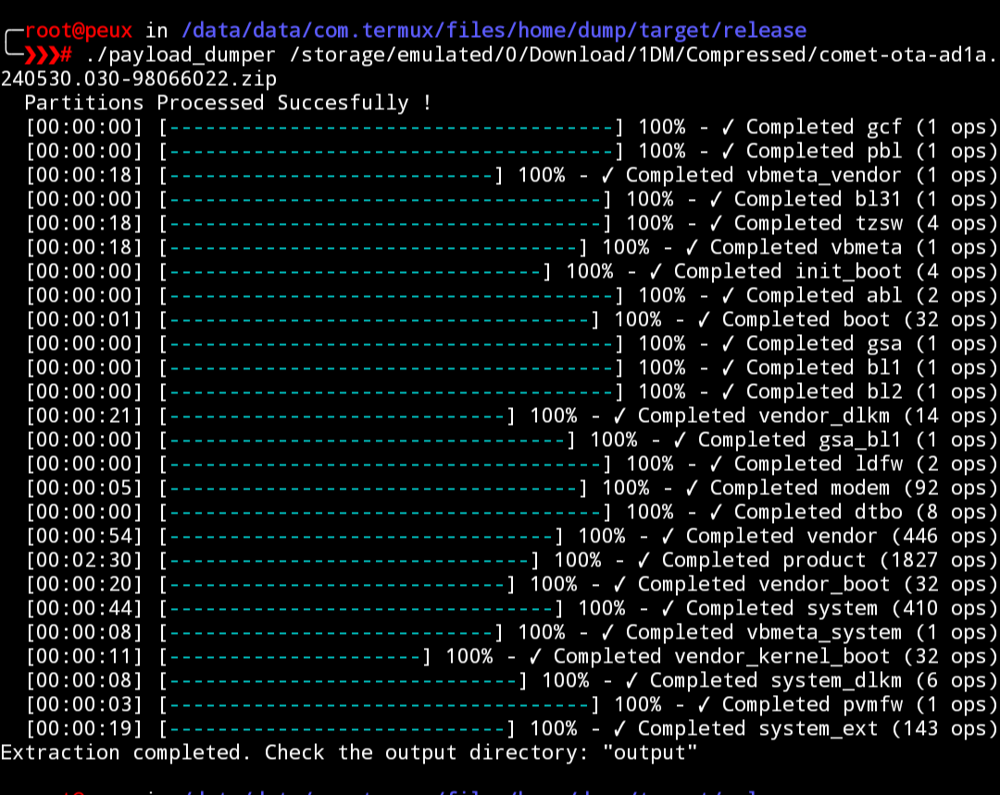

# payload-dumper-rust
Android OTA payload dumper written in Rust.

### What is Payload?

-  Android payload is a file that contains ROM partitions like boot , system, vendor . and others. Payload Dumper extracts these partitions from the payload.bin file

## features
- Extracts all or individual images directly from payload.bin or ROM ZIP file.

- Supports extracting individual partitions from URLs without downloading the full ROM ZIP.

- All decompression processes run in parallel for improved performance. ( can be customised by using`--no-parallel` or `--threads <n>` as argument )

---
- Output partitions Verification ✅
- Parallel Extraction ✅
- Selective Partition Extraction ✅
- Direct Extraction from URL ✅
- Incremental OTA support ❓ ( not tested )
---

## How To Use 
- Download Binaries for your respective Platform from [releases section](https://github.com/rhythmcache/payload-dumper-rust/releases/tag/0.3.0)
- If you are using a rooted android device you might want to install it as a [magisk module](https://github.com/rhythmcache/payload-dumper-rust/releases/download/0.3.0/payload_dumper-android-magisk-module.zip)

- For unrooted Android - run this in termux to install it
  ```
  bash <(curl -L "https://raw.githubusercontent.com/rhythmcache/payload-dumper-rust/main/scripts/termux-install.sh")
  ```
  

---

## **Performance Metrics** 

- Here are the performance metrics for **Payload Dumper Rust** running on a **Poco X4 Pro (SD695, 8GB RAM)** in Termux. The test file used is [comet-ota-ad1a.240530.030-98066022.zip](https://dl.google.com/dl/android/aosp/comet-ota-ad1a.240530.030-98066022.zip) (2.53GB).

| **Extraction Method**       | **Time Taken**       | **Notes**                          |
|-----------------------------|----------------------|------------------------------------|
| **Direct Payload Extraction** | **2 minutes 26 seconds** | Extracting directly from `payload.bin`. |
| **ZIP File Extraction**      | **2 minutes 30 seconds** | Extracting directly from the ZIP file. |
| **Remote URL Extraction**    | **Slower**           | Depends on network speed.          |

---

### Screenshots
- **Direct Payload Extraction**:  
  

- **ZIP File Extraction**:  
  

- **Remote URL Extraction**:  
  
  
---

### Usage :
#### Basic Usage

To extract partitions from a payload file, run the following command:

```bash
payload_dumper <path/to/payload.bin> --out output_directory
```
#### Direct ZIP Processing

it can directly process payloads from ZIP files without requiring manual extraction. Simply provide the path to the ZIP file:

```bash
./payload_dumper <path/to/ota.zip> --out <output_directory>
```

#### Remote Payloads

it can also handle payloads/zips directly using url.  Simply provide the URL as path. this is very slow compared to local 
extraction though.

```bash
./payload_dumper https://example.com/payload.bin
```
#### Individual partitions extraction.

- to extract individual partitions from payloads/URL/zips , use `--images` and enter the name of partitions you want to extract comma-separated.
- 
for example to just extract `boot` and `vendor_boot` from `url/zip/payload` , simply run

```
payload_dumper --images boot,vendor_boot <https://example.com/zip>
```

--- 

```
Usage: payload_dumper [OPTIONS] <PAYLOAD_PATH>

Arguments:
  <PAYLOAD_PATH>  
      Path to the payload file.
  --out <OUT>  
      Output directory for extracted partitions. [default: output]
  --diff  
      Enable differential OTA mode (requires --old).
  --old <OLD>  
      Path to the directory containing old partition images (required for --diff). [default: old]
  --images <IMAGES>  
      Comma-separated list of partition names to extract (default: all partitions)
  --threads <THREADS>  
      Number of threads to use for parallel processing.
  --list  
      List available partitions
  --metadata
      Save complete metadata as json ( use -o - to write to stdcout )
  --no-verify
      Skip Hash Verification    
  --no-parallel
      Disable parallel Extraction
```
---
#### Dependencies :
- See [Cargo.toml](./Cargo.toml)
- - [update_metadata.proto](https://android.googlesource.com/platform/system/update_engine/+/HEAD/update_metadata.proto)

---

#### Build :
To build this , you'll need:
- Rust compiler and Cargo
- protobuf-compiler
- Other obvious dependencies
- You may also need to link against libzip, zlib, and liblzma.

---

- ***To Build On Termux , Simply Run***
```
bash <(curl -L "https://raw.githubusercontent.com/rhythmcache/payload-dumper-rust/main/scripts/termux-build.sh")
```


### Credits
- This tool is inspired from [vm03/payload_dumper](https://github.com/vm03/payload_dumper)
